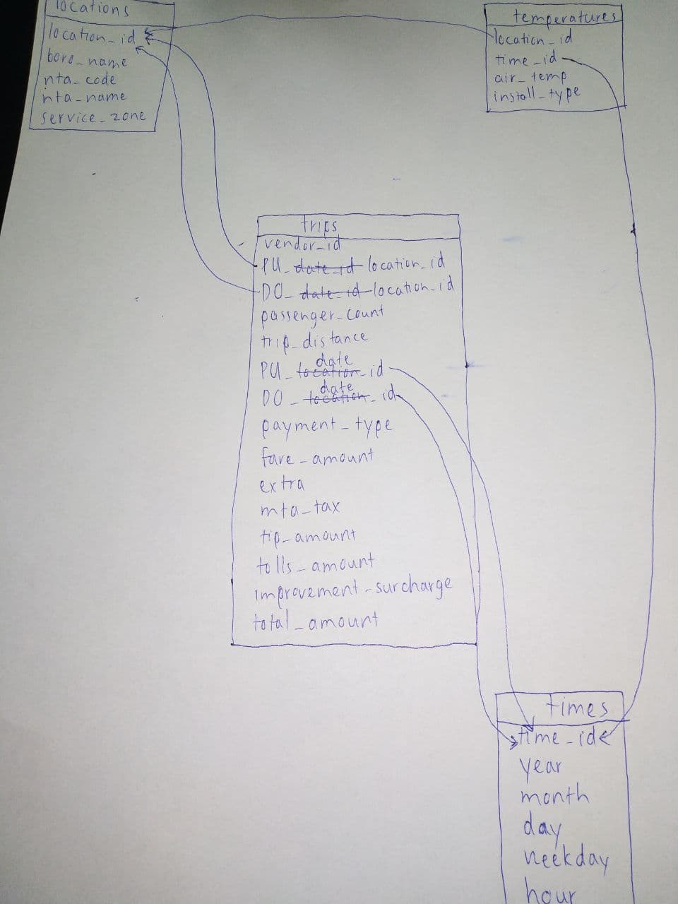
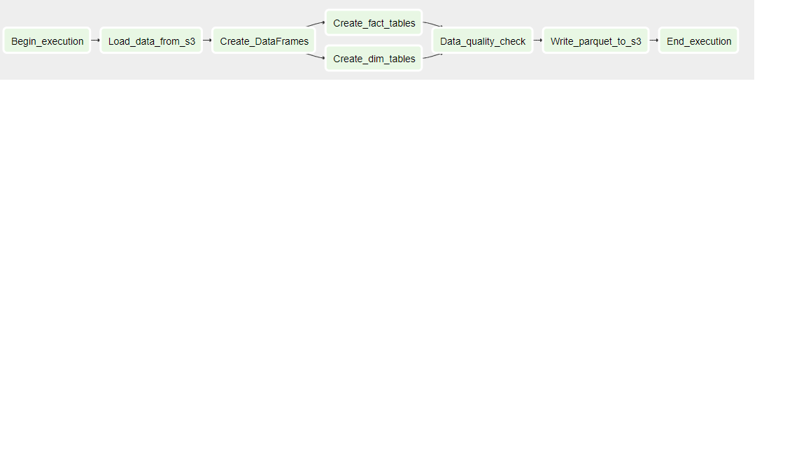

# Data engineering Capstone project
## Project Summary
This project attempts to combine information about taxi trips and air temperature information in different parts of NYC, which have been collected from different sources.

To achieve this, an external table containing information about NTA zones and codes has been collected, which acts as a middleman to connect the location IDs of the taxi trips and NTA codes of the temperature measurement stations.

The goal of this project is to investigate factors leading to the taxi trips around NYC, with the first and foremost element being the weather. For example, one can train a Machine Learning model to try to gauge how much impact air temperature has on people's tendency to choose taxi as their transportation. Looking into the future, information such as average salary or number of cars per household can further reinforce the connections.

## Files in this directory
- ```cfg```: Folder containing all configuration files
- ```data```: Folder containing the data along with the data dictionary
- ```md_resources```: Folder containing the resources necessary to populate this README
- ```python_modules```: Folder containing the Python functions used to run the Notebook
- ```capstone.ipynb```: Notebook with the main data pipeline

## Technologies used

The main technology of choice here is Spark on Python (using the Pyspark library). Spark provides an excellent infrastructure to process the large amount of data (having over 1 million rows), with an added benefit of being able to use the familiar SQL to work around with the data.

For the data storage, AWS S3 was chosen as it is a cloud storage, meaning one can access the data from anywhere with just an internet connection. S3 also makes it easier to work with other AWS tools like Redshift in the long run (even though it is yet to be implemented in this project).

Airflow was only used to make the DAG in the ```Data pipeline``` section below, but in the future it can be used to orchestrate and schedule the pipeline itself as well.

## Data sources
Data used in this project was taken from the following sources:

- [NYC Taxi and Limousine Commission (TLC) Trip Record Data](https://www1.nyc.gov/site/tlc/about/tlc-trip-record-data.page). This is the main component of the ```trips``` table in the project (look for July 2018 Yellow Taxi Trip Records) . Additionally, the Taxi Zone Lookup Table was also taken from the same website to link the location ID to the name of a NTA zone.
- [NYC 2010 Neighborhood Tabulation Areas](https://data.cityofnewyork.us/City-Government/2010-Neighborhood-Tabulation-Areas-NTAs-/cpf4-rkhq). This is used to connect each NTA codes in the ```temperatures``` table to a location ID in the ```trips``` table.
- [NYC Hyperlocal Temperature Monitoring](https://data.cityofnewyork.us/dataset/Hyperlocal-Temperature-Monitoring/qdq3-9eqn). This temperature is used for the second fact table, containing NYC's air temperatures during the month of July 2018.

## Data model
The whole database follows a star schema, which can be viewed in the ```schema.jpg``` file, or down below:



There are 2 fact tables in total, namely ```trips``` and ```temperatures```, and 2 supporting dimension tables: ```locations``` and ```times```. This schema requires less storage space than the other schemas, with a trade-off of having to do multiple ```JOIN``` operations. However, as there are more than one fact table present, we are in a situation where doing ```JOIN``` is inevitable. Therefore, it would be best to capitalize on the low storage that star schemas offer.

## Data pipeline

The image below shows the simplified pipeline for processing the data:



While this current data pipeline is quite limited, it can easily be expanded by further uploading the completed table to a cloud data warehouse such as Amazon Redshift.
Meanwhile, Airflow can be used to orchestrate the full pipeline, allowing us to start the whole process using just a few mouse clicks. While Jupyter Notebook can accomplish the same goal, it lacks the ability to set a running schedule and backfill. If Airflow were to be used, then data should be updated once every month, given the fact that NYC taxi data comes in one month at a time, making backfilling a lot more convenient this way.

The specifics of the pipeline can be found in the ```capstone.ipynb``` notebook.

## Project expansion
As with every Big Data project, one can never anticipate the volume of data that will come in, so it is always a good idea to plan ahead for different scenarios:
- If the amount of data was increased by 100x, a stronger infrastructure is required. In my case, Spark sometimes caused lags and spikes to my machine with just 70MB of data, so 100 times that will surely freezes it more often than not, making the processing speed even lower than it should. The easiest way is just to rent a cheap cloud computing infrastructure that can do Spark reliably, for example AWS EMR.
- The pipelines having to run at 7AM every day is a fairly unrealistic case as the data is updated every month, but if that were to happen, then I can simply set the Airflow scheduling (which should be implemented by then) to run on a daily basis.
- Since the data is not updated very often, it might be a good idea to create multiple copies of the database (replication) to circumvent the large amount of people concurrently accessing. While it will increase the maintenance cost, I believe the benefits (in speed and latency) will surely outweigh the drawbacks.

